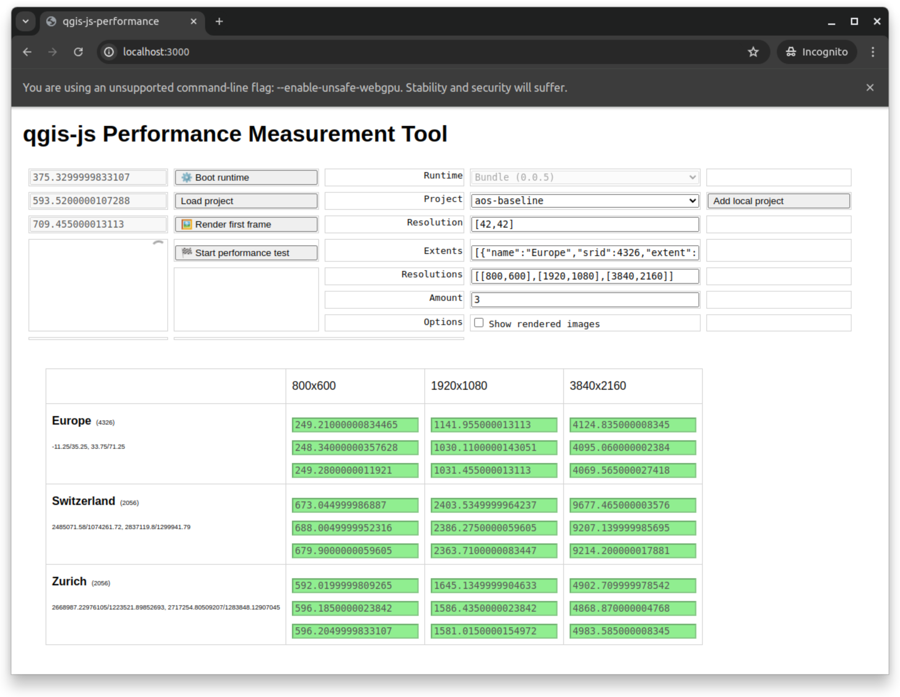
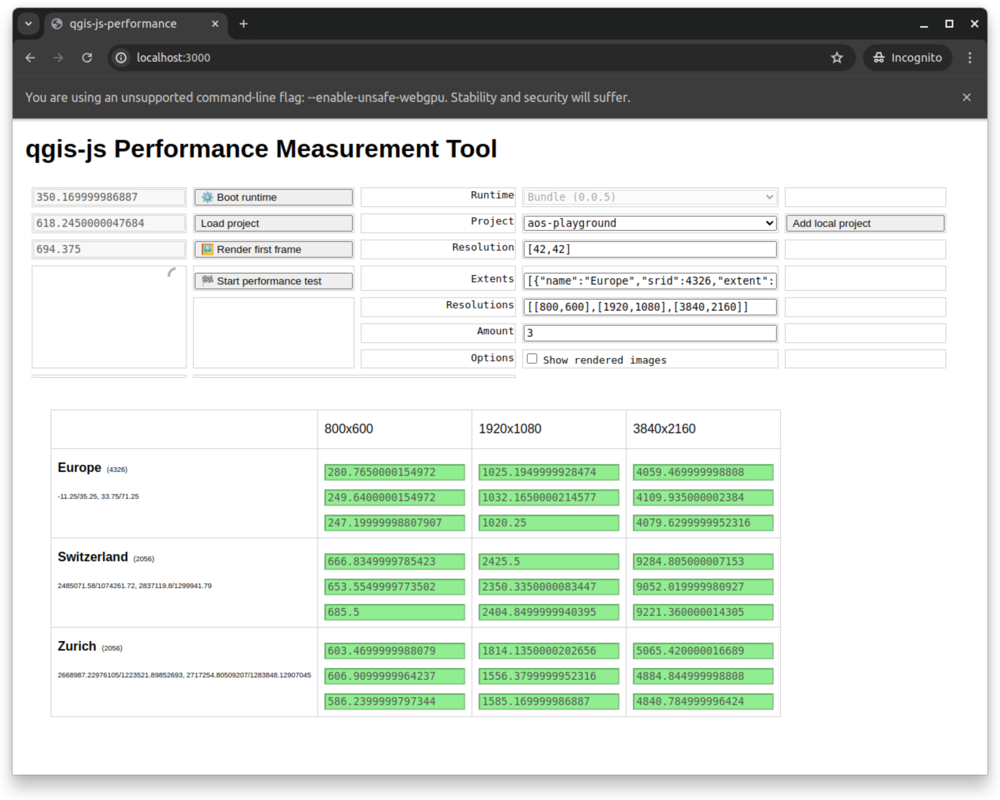
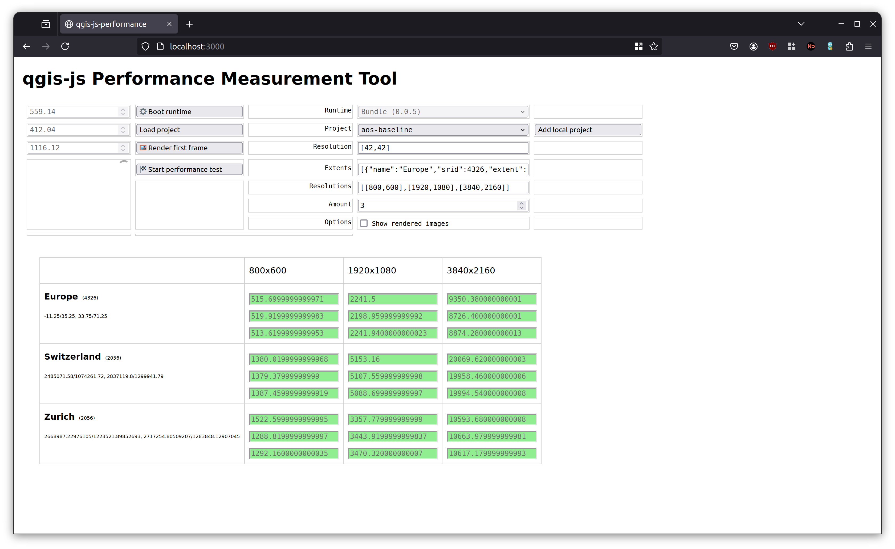
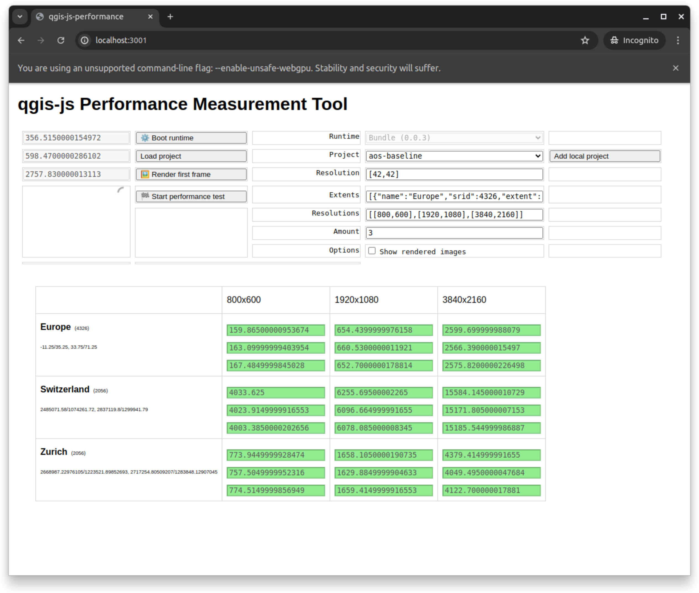
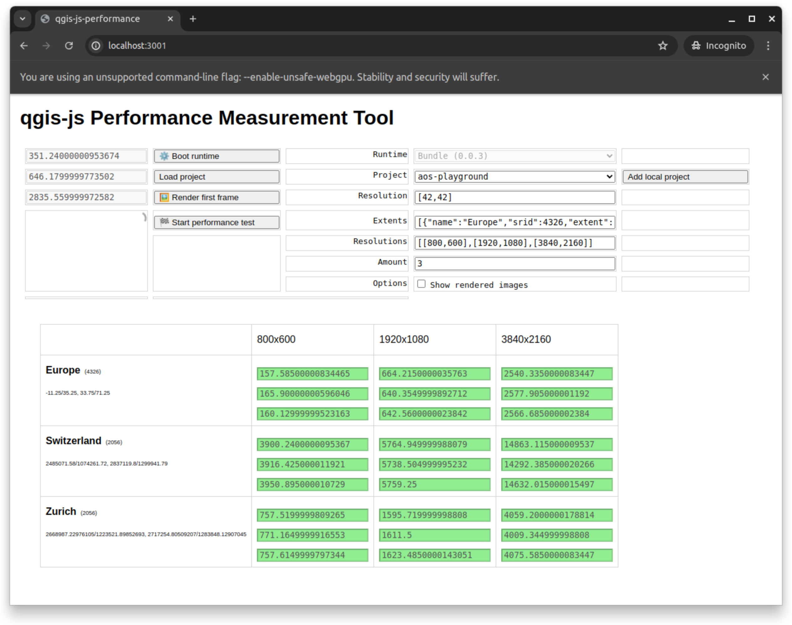
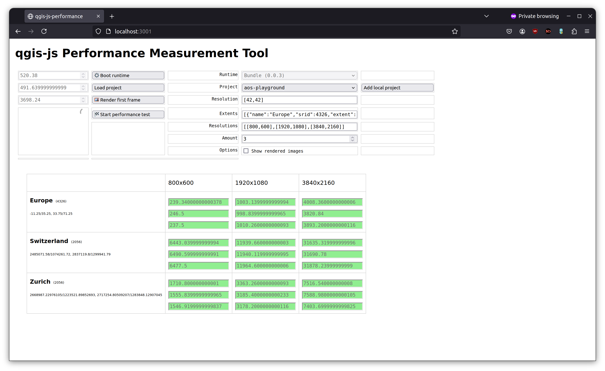

# qgis-js Performance Comparison (between version `0.0.3` and `0.0.5`)

> see [`docs/performance.md`](https://github.com/qgis/qgis-js/blob/main/docs/performance.md) in the qgis-js repository for more information

## Setup

- **Projects**:
  - [`aos-baseline`](https://github.com/boardend/qgis-js-projects/tree/main/performance/aos-baseline)
    - Original "AoS - Precipitation per balance basin" project
  - [`aos-playground`](https://github.com/boardend/qgis-js-projects/tree/main/performance/aos-playground)
    - Optimized "AoS - Precipitation per balance basin" project
- **Extent**: Switzerland
  - `2485071.58`/`1074261.72`, `2837119.8`/`1299941.79` (EPSG:2056)
- **Resolution**: `1920x1080`
- **Device**: Lenovo ThinkPad T14 Gen 3, AMD® Ryzen 7 pro 6850u, 32 GB RAM
- **Tool**: The qgis-js "qgis-js Performance Measurement Tool"
  - see [`site/performance`](https://github.com/qgis/qgis-js/tree/main/sites/performance)

## Results

| Measurements                          | T1        | T2        | T3        | Avg. (ms) |
| ------------------------------------- | --------- | --------- | --------- | --------- |
| `perf_measure_005_chrome_baseline`    | 2'403.53  | 2'386.28  | 2'363.71  | 2'384.51  |
| `perf_measure_005_chrome_playground`  | 2'425.50  | 2'350.34  | 2'404.85  | 2'393.56  |
| `perf_measure_005_firefox_baseline`   | 5'153.16  | 5'107.56  | 5'088.70  | 5'116.47  |
| `perf_measure_005_firefox_playground` | 5'069.82  | 5'176.48  | 5'181.02  | 5'142.44  |
| `perf_measure_003_chrome_baseline`    | 6'255.70  | 6'096.66  | 6'078.09  | 6'143.48  |
| `perf_measure_003_chrome_playground`  | 5'764.95  | 5'738.50  | 5'759.25  | 5'754.23  |
| `perf_measure_003_firefox_baseline`   | 11'787.60 | 11'776.52 | 11'708.52 | 11'757.55 |
| `perf_measure_003_firefox_playground` | 11'939.66 | 11'940.12 | 11'964.60 | 11'948.13 |

## Interpretation

- Rendering time could be redueced significantly between version `0.0.3` and `0.0.5`:
  - Chrome: `41.60%`
  - Firefox: `43.04%`
- Chrome is performing better than Firefox
  - Ratio rendering time Chrome/Firefox: `0.47`
- Difference between "Baseline"/"Playground" project is negligible
  - `100.38%`, `100.51%`, `93.66%`, `101.62%`

## Measurements

### qgis-js `0.0.5`

#### Chrome

Baseline Project: [`aos-baseline`](https://github.com/boardend/qgis-js-projects/tree/main/performance/aos-baseline)

Playground Project: [`aos-playground`](https://github.com/boardend/qgis-js-projects/tree/main/performance/aos-playground)

#### Firefox

Baseline Project: [`aos-baseline`](https://github.com/boardend/qgis-js-projects/tree/main/performance/aos-baseline)

Playground Project: [`aos-playground`](https://github.com/boardend/qgis-js-projects/tree/main/performance/aos-playground)

### qgis-js `0.0.3` ("baseline")

#### Chrome

Baseline Project: [`aos-baseline`](https://github.com/boardend/qgis-js-projects/tree/main/performance/aos-baseline)

Playground Project: [`aos-playground`](https://github.com/boardend/qgis-js-projects/tree/main/performance/aos-playground)

#### Firefox

Baseline Project: [`aos-baseline`](https://github.com/boardend/qgis-js-projects/tree/main/performance/aos-baseline)

Playground Project: [`aos-playground`](https://github.com/boardend/qgis-js-projects/tree/main/performance/aos-playground)

## License

[CC0-1.0 license](./LICENSE)